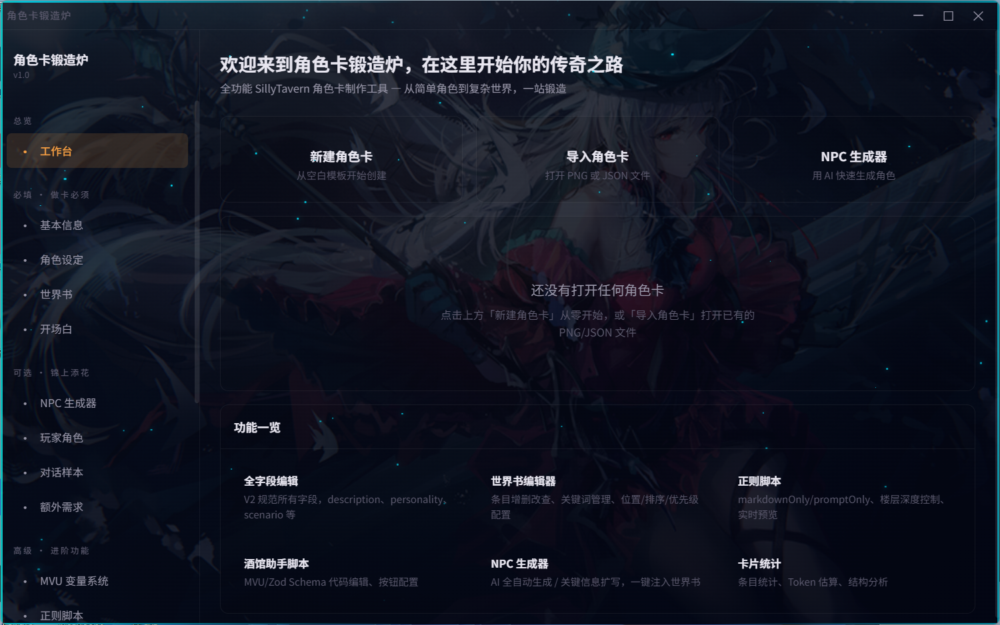

# SillyTavern CardForge — 角色卡锻造炉

> 一站式 SillyTavern 角色卡全功能制作工具，基于 Electron + Vue 3 的桌面应用。



## 下载安装包（推荐）

**不想折腾命令行？直接下载安装包，双击安装即可使用：**

**[点击下载 CardForge v2 安装包](https://github.com/Anastasia2372/sillytavern-cardforge/releases/download/v2/SillyTavern.CardForge.Setup.v2.exe)**

> Windows 可能会弹出 SmartScreen 警告，点击「仍要运行」即可。

---

## 这是什么

CardForge 是一款专为 SillyTavern 用户设计的桌面级角色卡制作工具，把"基本信息编辑、世界书设计、变量系统、正则脚本、酒馆助手脚本、EJS 模板、前端状态栏、PNG 打包"等所有制卡环节集成在一个界面里，让做卡不再需要在 7 个软件之间反复切换。

无论你是想快速做一张简单的角色扮演卡，还是搭建一个带 MVU 变量系统、动态状态栏、复杂世界书的"游戏化"角色卡，CardForge 都能用直观的可视化界面完成全部工作。

---

## 主要功能

### 制卡核心
- **基本信息编辑** — 全部 V2 字段（name / description / personality / scenario / first_mes / mes_example / system_prompt / depth_prompt 等）
- **开场白编辑器** — AI 全自动生成 + 多种风格预设 + HTML 美化预览（可选自动美化）
- **世界书编辑器** — 完整字段支持、AI 批量生成、批量启用/禁用/删除、数字框 + 拖拽双向排序、筛选搜索

### AI 辅助
- **NPC 生成器** — 全自动 / 关键信息扩写两种模式，4 种描述风格，根据卡片自动选择
- **AI 助手** — 内置三个个性鲜明的 Live2D AI 娘，可对话 + 角色卡诊断
- **支持多家 AI 服务商** — OpenAI 兼容 / Claude / Gemini，可同时配置多个，一键切换

### 高级功能
- **MVU 变量系统** — 可视化设计变量结构，自动生成 Zod Schema + 完整 13 件套
- **正则脚本编辑器** — 入门三件套 / 完整 MVU 套装一键添加 + 模板库
- **酒馆助手脚本** — 内置常用模板，AI 全自动生成
- **EJS 模板编辑器** — 编辑 + 模拟变量预览 + 渲染测试
- **前端状态栏** — 根据 MVU 变量自动生成动态 HTML 状态栏，iframe 实时预览

### 打包与导入
- **PNG / JSON 双格式** — 支持导入和导出
- **导入修改后一键覆盖原文件** — 不需要重新选择保存路径
- **导出前健康检查** — 自动发现常见问题（仅供参考，不阻止导出）
- **卡片统计** — 详细的字段、世界书、脚本统计

### UI 设计
- 深色透明主题 + 鬼火青蓝色流光边框 + 星空粒子背景
- 黑金 / 银白流光按钮
- 全中文界面

---

## 安装与运行

### 前置要求

- **Node.js** 16 或以上版本 — [下载地址](https://nodejs.org/)
  - 安装时勾选"Add to PATH"
  - 安装完成后打开终端输入 `node -v` 确认能看到版本号
- **Git** — [下载地址](https://git-scm.com/)
  - 安装时一路默认即可

### 第一步：下载项目

打开终端（Windows 搜索"cmd"或"PowerShell"），先下载项目：

```bash
git clone https://github.com/Anastasia2372/sillytavern-cardforge.git
```

下载完成后，进入项目目录：

```bash
cd sillytavern-cardforge
```

### 第二步：安装依赖

```bash
npm install
```

这一步会自动下载所有需要的库，可能需要几分钟，等它跑完就行。

如果遇到网络问题，可以先设置国内镜像：

```bash
npm config set registry https://registry.npmmirror.com
npm install
```

### 第三步：打包运行

```bash
npm run build
npx electron-builder --win --x64 --dir
```

打包完成后在 `dist_electron/win-unpacked/` 目录里找到 `SillyTavern CardForge.exe`，双击运行。

> **开发模式（仅供需要修改源代码的开发者使用，普通用户请忽略）**
>
> ```bash
> npm run dev
> ```
>
> 启动开发服务器，修改代码后界面会自动刷新。注意：开发模式下部分功能（如 API 设置保存、角色卡导入）可能不稳定，请以打包后的正式版为准。

### 第四步：配置 API

打开软件后，点左侧「API 设置」，填入你自己的 API Key。支持：

- **OpenAI 兼容**（包括各种中转）
- **Claude (Anthropic)**
- **Gemini (Google)**

填好 Key 后 AI 辅助功能（世界书生成、NPC 生成、AI 助手等）就能用了。不配置 API 也可以手动编辑，只是没有 AI 辅助。

### 常见问题

**Q: npm install 报错**
A: 检查 Node.js 版本是否 >= 16，试试用管理员权限运行终端。

**Q: 打包时报错**
A: 确保 `npm run build` 先执行成功再跑 electron-builder。

**Q: 打开后白屏**
A: 用开发模式 `npm run dev` 试试，看终端有没有报错信息。

### 如何更新到最新版

已经安装过的用户，不需要重新下载。打开终端，进入项目目录。

拉取最新代码：

```
git pull
```

重新编译：

```
npm run build
```

重新打包：

```
npx electron-builder --win --x64 --dir
```

打包完成后在 `dist_electron/win-unpacked/` 里找到新的 exe 运行即可。你之前的配置（API Key 等）不会丢失。

---

## Live2D 模型说明 ★

**本仓库不包含任何 Live2D 模型资源**。要在 AI 助手页面看到角色画面，请按以下步骤：

1. 自行准备符合 **Cubism 4** 规范的 Live2D 模型，包含：
   - `.model3.json`（主配置文件）
   - `.moc3`（模型骨骼）
   - 贴图 `.png`
   - 表情、动作等子文件
2. 把模型文件夹放到任意位置（比如 `public/live2d/yourmodel/`）
3. 启动软件 → AI 助手页面 → 设置按钮 → 给每个角色点击「选择 .model3.json 文件」→ 浏览选择
4. 保存配置

如果不配置模型，AI 助手页面的画布会保持空白，但聊天功能仍可正常使用。

---

## 致谢

### 技术
- [Electron](https://www.electronjs.org/) — 桌面应用框架
- [Vue 3](https://vuejs.org/) + [Pinia](https://pinia.vuejs.org/) + [Vite](https://vitejs.dev/) — 前端技术栈
- [pixi.js v6](https://pixijs.com/) + [pixi-live2d-display](https://github.com/guansss/pixi-live2d-display) — Live2D 渲染
- [Live2D Cubism SDK](https://www.live2d.com/) — Cubism 运行时
- [SillyTavern](https://github.com/SillyTavern/SillyTavern) — 本工具的最终目的就是为它服务

### 个人
特别感谢 **Martin** 朋友在开发过程中提供的灵感和建议。

---

## License

本项目采用 [GPL-3.0](LICENSE) 许可证发布。

简单来说：
- ✓ 你可以自由使用、修改、分发本软件
- ✓ 你可以将其用于个人或商业用途
- ✗ 但如果你修改后再分发（无论是否商用），**必须也用 GPL-3.0 开源**
- ✗ 不得在不开源的闭源产品中使用本项目的代码

完整许可证条款请见 [LICENSE](LICENSE) 文件。

---

## 作者

作者：**Anastasia2372**

如果觉得这个工具对你有帮助，欢迎 Star ⭐
